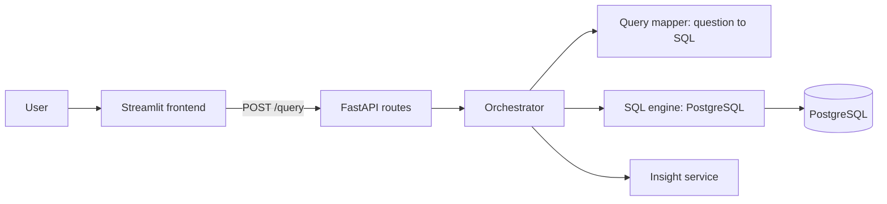

# AI Analytics Assistant

Ask business questions in plain English and get back the SQL, the data, and a short business insight, all in one screen.

Built with **FastAPI**, **Streamlit**, and **PostgreSQL**.

## How it works



1. The user types a question in the Streamlit app.
2. The frontend sends it to the FastAPI `/query` endpoint.
3. The orchestrator maps the question to a SQL query, runs it against PostgreSQL, and generates an insight from the results.
4. The frontend shows the generated SQL, the data, and the insight.

## Current capabilities

The query mapper currently recognizes these kinds of questions:

| Example question | What it does |
|---|---|
| "Show customer churn trends" | Counts customers by churn status |
| "Who are the high spending customers?" | Customers with monthly spend over 100 |
| "What is the average spend?" | Average monthly spend |
| "Show all customers" | Lists customers |

SQL generation and insights are rule-based at this stage. See the roadmap for LLM integration.

## Project structure

```
.
├── frontend.py            # Streamlit UI
├── requirements.txt
├── schema.sql             # Sample table and data
├── .env.example
└── app/
    ├── main.py            # FastAPI app and health check
    ├── routes.py          # POST /query endpoint
    ├── schemas.py         # Request model
    ├── orchestrator.py    # Coordinates SQL, execution, insight
    ├── query_mapper.py    # Question to SQL
    ├── sql_engine.py      # PostgreSQL execution
    └── llm_service.py     # Insight generation
```

## Getting started

**1. Install dependencies**

```bash
python -m venv venv
source venv/bin/activate        # Windows: venv\Scripts\activate
pip install -r requirements.txt
```

**2. Set up the database**

```bash
createdb analytics
psql -d analytics -f schema.sql
```

**3. Configure environment variables**

```bash
cp .env.example .env
# edit .env with your database credentials
```

**4. Run the backend**

```bash
uvicorn app.main:app --reload
```

API docs are at http://127.0.0.1:8000/docs.

**5. Run the frontend** (in a second terminal)

```bash
streamlit run frontend.py
```

## API

`POST /query`

```json
{ "question": "Show customer churn trends" }
```

Response:

```json
{
  "question": "Show customer churn trends",
  "sql_query": "SELECT churn_status, COUNT(*) AS total_customers FROM customers GROUP BY churn_status",
  "data": [
    { "churn_status": "No", "total_customers": 8 },
    { "churn_status": "Yes", "total_customers": 4 }
  ],
  "insight": "Customer retention appears stable."
}
```

## Roadmap

- [ ] LLM-based text-to-SQL with schema awareness
- [ ] SELECT-only SQL validation and read-only database user
- [ ] LLM-generated insights with rule-based fallback
- [ ] Charts for trend questions
- [ ] More tables (orders, products) and tests
- [ ] Docker setup

## Tech stack

Python, FastAPI, Streamlit, PostgreSQL (psycopg2), Pydantic
